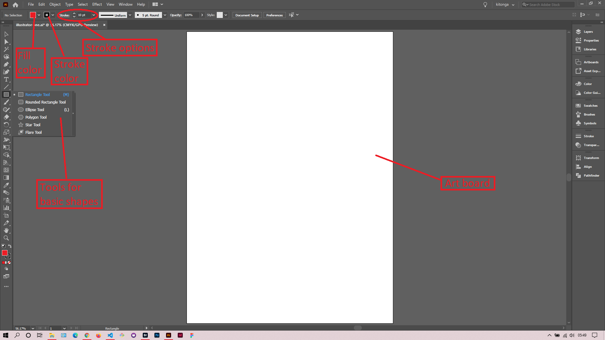
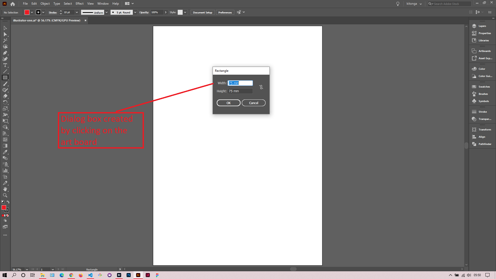
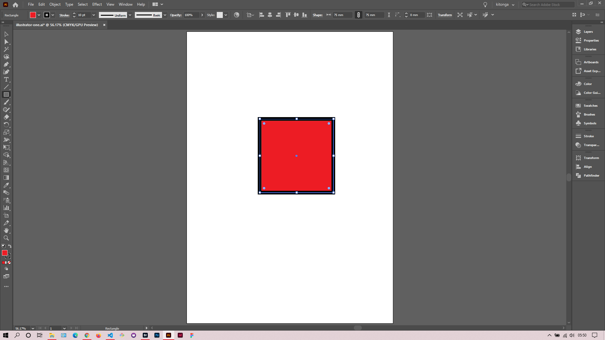
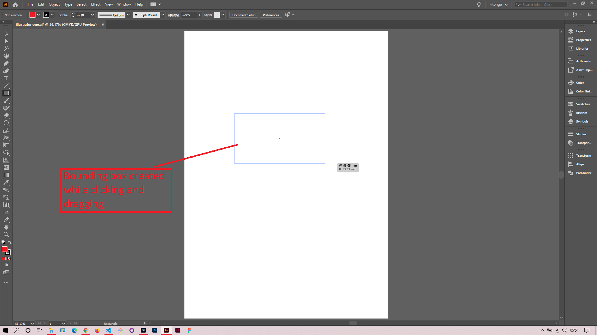
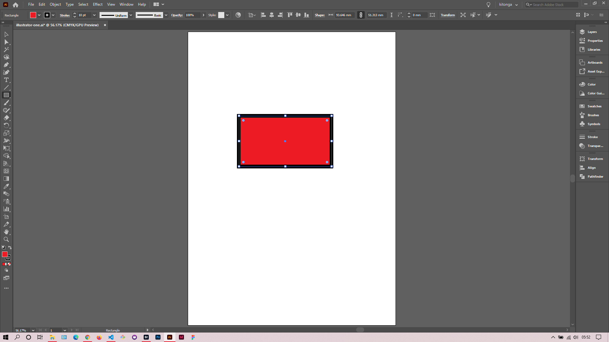
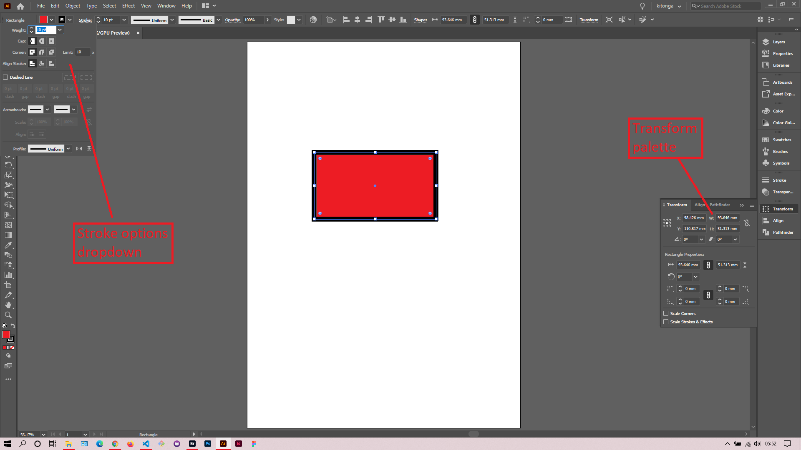

## About Lesson 01

### Brief
In this lesson, I was introduced to basic shapes objects in illustrator. The various tools for drawing shapes include:
- Rectangle Tool
- Rounded Rectangle Tool
- Ellipse Tool
- Polygon Tool
- Star Tool
- Flare Tool

### Illustrations

In the illustrations below, I created a rectangle by selecting the Rectangle Tool and clicking on the art board. This opens a dialog box for entering the dimensions.

Here, I created the rectangle in the art board by clicking and dragging to the desired size.

Here, I was able to adjust the various alignment, weight options of the stroke in the stroke options dropdown(accessed by clicking on ``Stroke`` in the control bar). I was also able to adjust the width and height of the rectangle via the ``Transform`` palette.

### Online Course
Visit [IACT](https://iact.ie) for the course