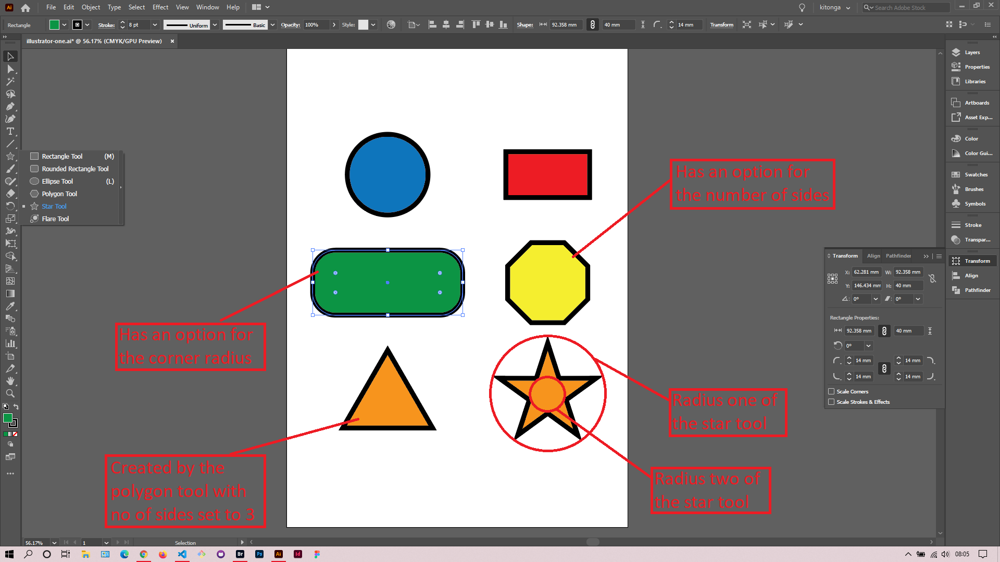

## About Lesson 02

### Brief
In this lesson, I learned about the shape tools and their various options. The tools for drawing shapes include:
- Rectangle Tool
- Rounded Rectangle Tool
- Ellipse Tool
- Polygon Tool
- Star Tool
- Flare Tool

### Illustrations

In the illustration below, I created different shapes using the shape tools and modified the different options for each tool.

### Online Course
Visit [IACT](https://iact.ie) for the course