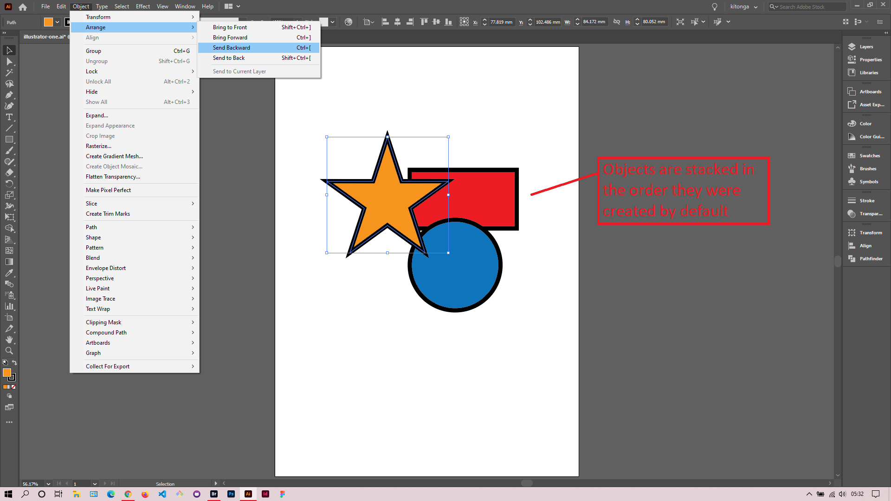

## About Lesson 03

### Brief
In this lesson, I learned about the stacking order of objects and how to arrange them. We can change the stacking order of objects via the options under the menu ``Object > Arrange``. The available arrangement options include:
- Bring to Front - brings object to the front of all other objects.
- Bring Forward - brings object one step forward from the order position it currently is.
- Send Backward - sends object one step back from the order position it currently is.
- Send to Back - sends to the back of all other objects.

### Illustrations

In the illustration below, I changed the order position of the star to be on top of the rectangle and ellipse.

### Online Course
Visit [IACT](https://iact.ie) for the course