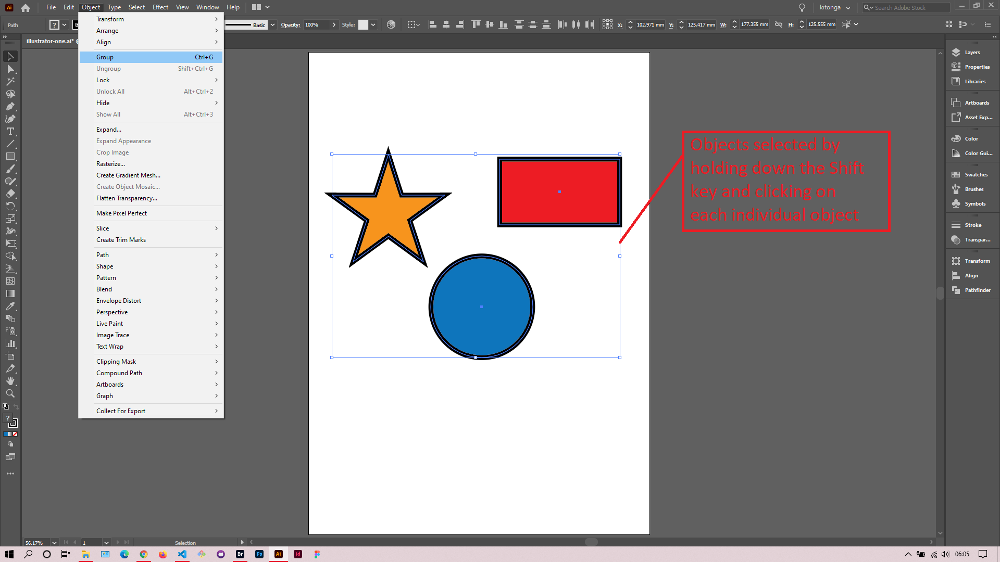
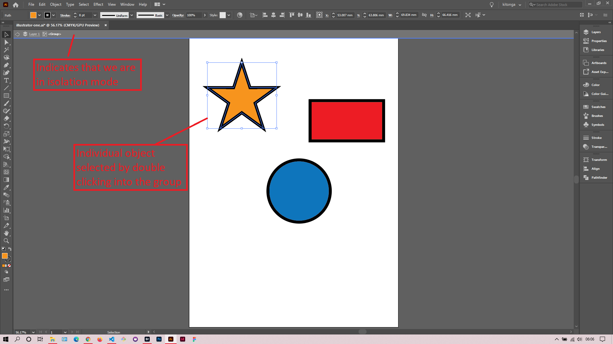
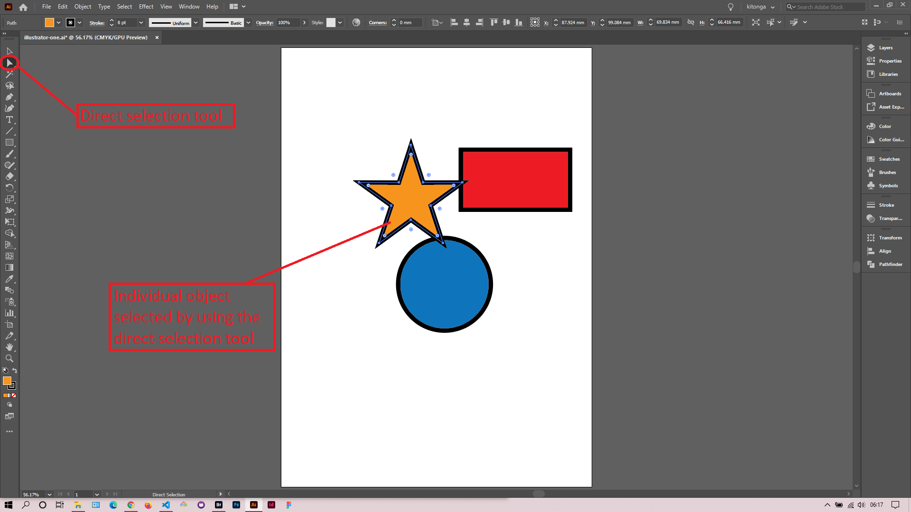

## About Lesson 04

### Brief
In this lesson, I learned about how to select and group objects. Grouping objects gives us the ability to modify multiple objects at the same time.

### Illustrations

In the illustrations below, I first select the objects I wanted to group by holding down the shift key and clicking on each object. Once selected, I navigated to the menu ``Object > Group`` to group the selected objects.

Here, I could select each individual object in the group by double clicking in the group. This gets you into ``isolation`` mode which allows us to select and modify an object.

Another way to select an object in a group is to use the direct selection tool. With this tool I can immediately click on an object and modify it to my liking.

### Online Course
Visit [IACT](https://iact.ie) for the course