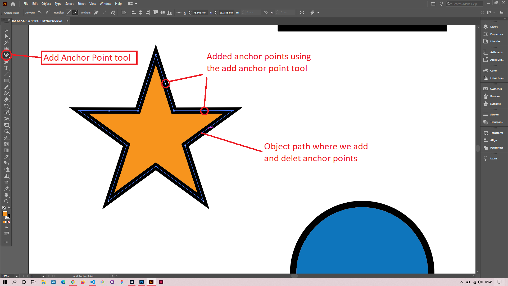
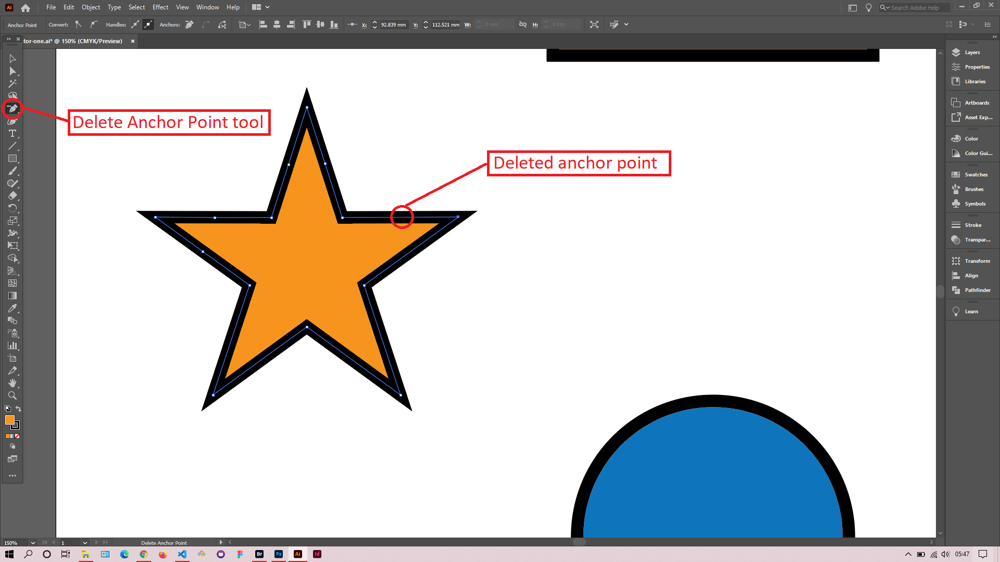
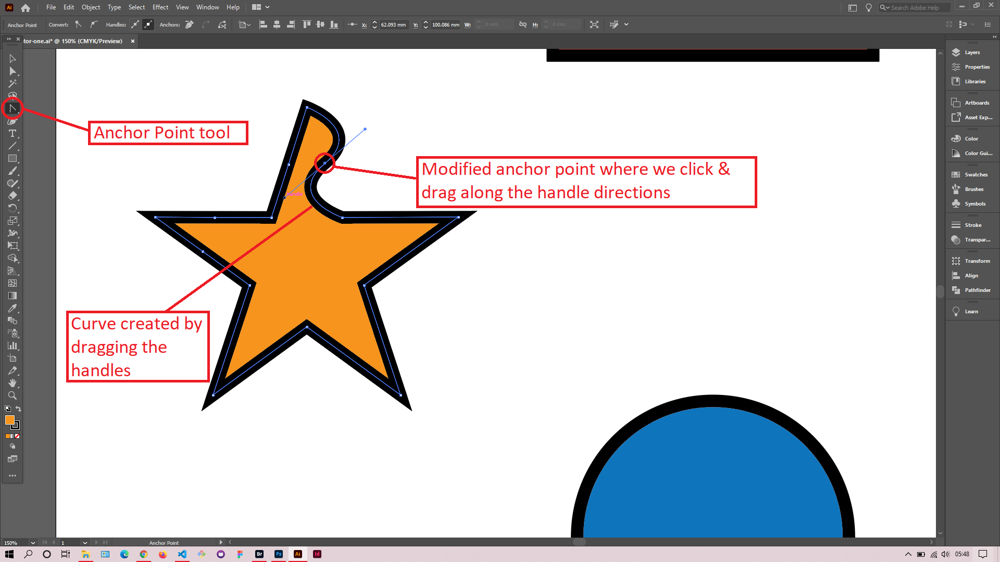

## About Lesson 05

### Brief
In this lesson, I learned about using the pen tool to modify anchor points of objects.

### Illustrations

In the illustration below, I used the add anchor point tool to add anchor points to the path of the object.

Here, I used the delete anchor point tool to delete anchor points from the path.

Just like in photoshop, I used the anchor point tool to create curves in the path by clicking and dragging along the handles. We drag sideways to increase the effect of the curve and drag up or down to modify its direction.

### Online Course
Visit [IACT](https://iact.ie) for the course