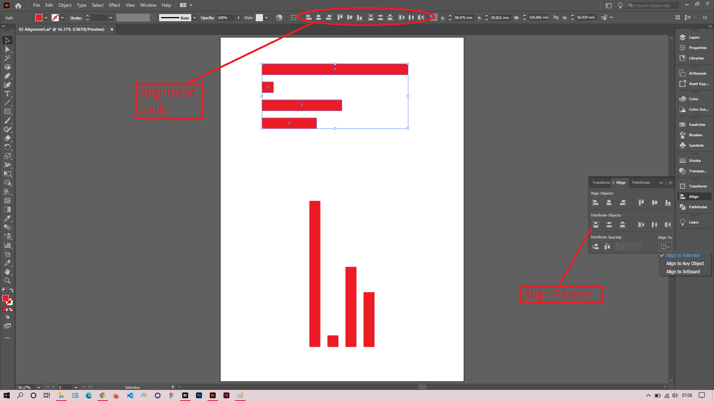

## About Lesson 06

### Brief
In this lesson, I learned about the alignment tools and how they work. There are those that align horizontally and those that align vertically. We can also distribute space between objects. The alignment tools can be found in the `Control bar` or under the `Align` palette

### Illustrations

In the illustration below, I used the horizontal alignment tools to align the selected objects.

### Online Course
Visit [IACT](https://iact.ie) for the course