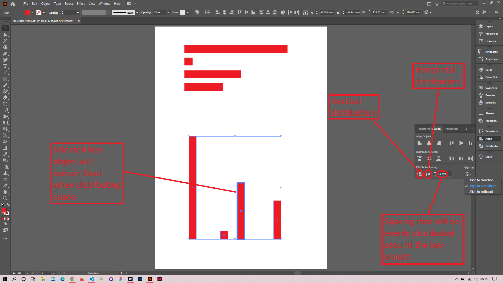
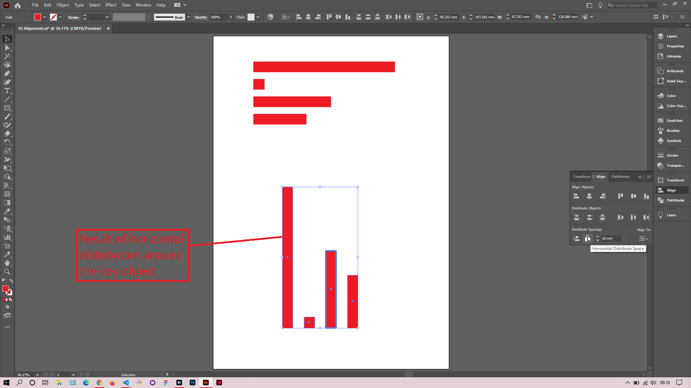

## About Lesson 07

### Brief
In this lesson, I learned how to use the distribution tools under the `Align` palette. These tools are used to distribute space between objects vertically or horizontally.

### Illustrations

In the illustration below, I first clicked on the option `Align to Key Object` and selected the key object that will remain fixed when distributing space. I then entered the amount of space to be distributed to all objects around the key object selected.

Here I clicked on the `Horizontal Distribute Space` button and got the result as illustrated.

### Online Course
Visit [IACT](https://iact.ie) for the course