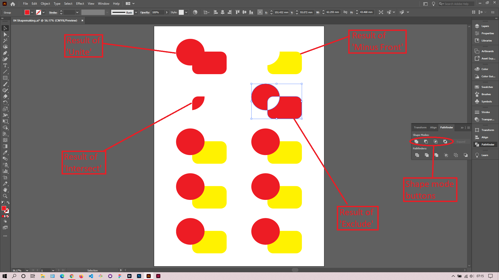

## About Lesson 08

### Brief
In this lesson, I learned about the various shape modes available under the Pathfinder palette. These modes assist in creating new shapes by merging two or more shape objects together.

### Illustrations

In the illustration below, I selected to shapes together and would click on the shape modes to get the below results.

### Online Course
Visit [IACT](https://iact.ie) for the course