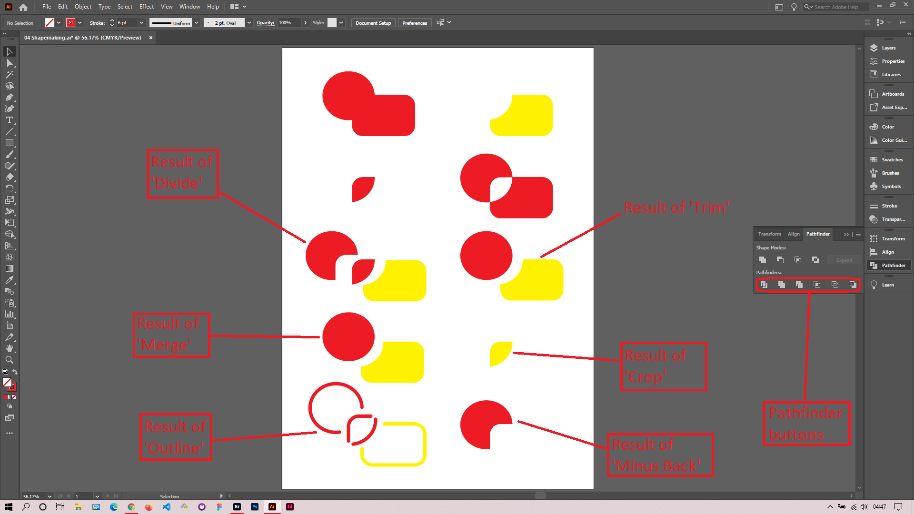

## About Lesson 09

### Brief
In this lesson, I learned about the various pathfinder options under the Pathfinder palette. 

### Illustrations

In the illustration below, I selected two shapes together and would click on the pathfinder options to get the below results.

### Online Course
Visit [IACT](https://iact.ie) for the course