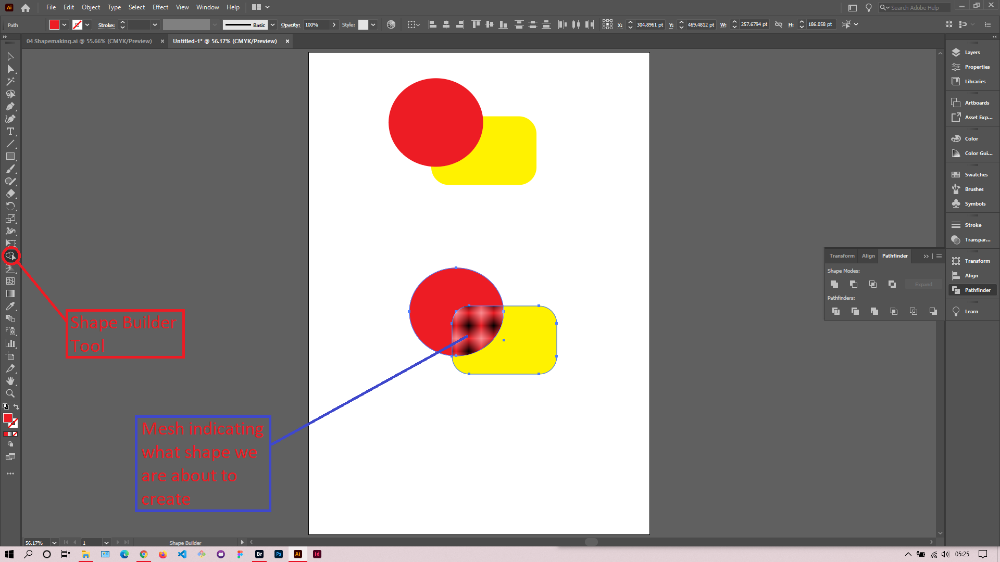
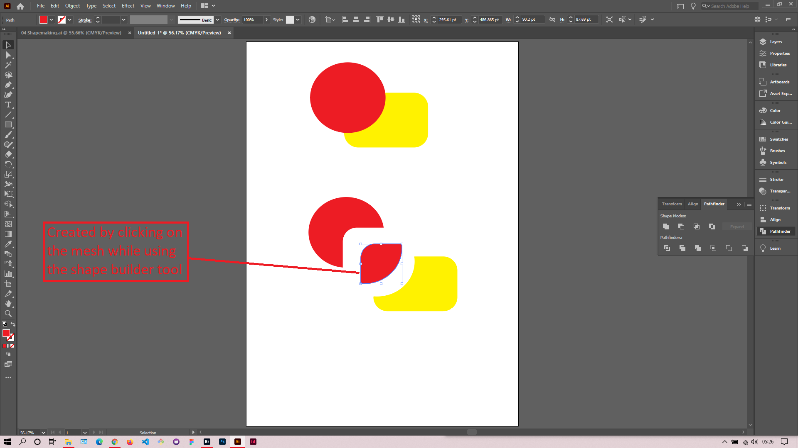

## About Lesson 10

### Brief
In this lesson, I learned about the Shape Builder Tool which helps us to create shapes from other shapes.

### Illustrations

In the illustration below, I first selected the shapes together. Using the shapes builder tool I hovered over the 3 sections of the shapes and clicked on the section I wanted to create a shape from.

Here I used the Selection Tool to move the shape created.

### Online Course
Visit [IACT](https://iact.ie) for the course