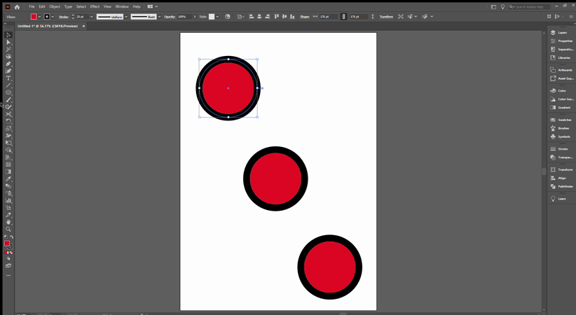

## About Lesson 11

### Brief
In this lesson, I learned about cutting tools in Illustrator. I used these tools to cut shape objects into smaller shapes. They include:
- Eraser Tool
- Scissor Tool
- Knife Tool

### Illustrations

In the illustration below, I used the Scissor Tool to cut the first circle by adding two anchor points to the shape path. I then clicked into the artboard to deselect the grouped shapes and moved the two pieces away using the Selection Tool.

Here I used the Knife Tool which is used to cut freehand.

Here, I used the Eraser Tool.

### Online Course
Visit [IACT](https://iact.ie) for the course