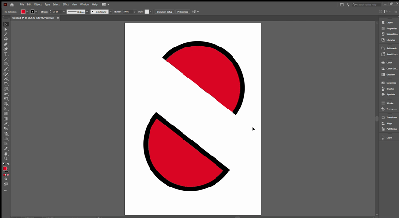
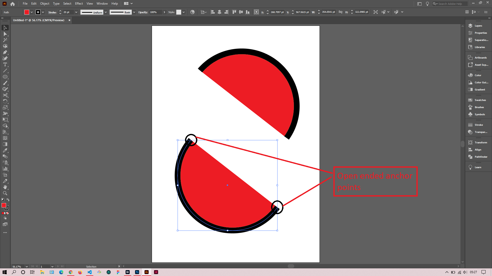
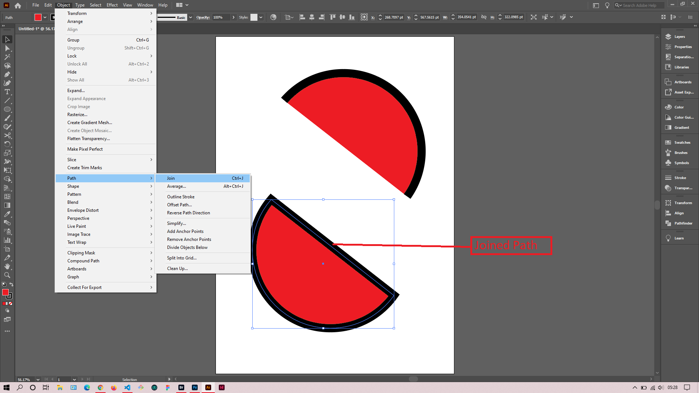

## About Lesson 12

### Brief
In this lesson, I learned about cutting and joining paths in illustrator. Here I use the pen tool and the menu `Object > Path > Join` to join open ended anchor points.

### Illustrations

In the illustration below, I used the Pen Tool to click on each open ended anchor point which inturn drew a path to join them.

Here I joined the anchor points by first selecting the object then navigating to the menu `Object > Path > Join`(Ctrl + J)

Here, I used the direct selection tool to select the specific anchor point that I wanted to cut and clicked on the scissor icon in the control bar. This inturn cut the path and I repeated the procedure to other anchor points in the path.

### Online Course
Visit [IACT](https://iact.ie) for the course