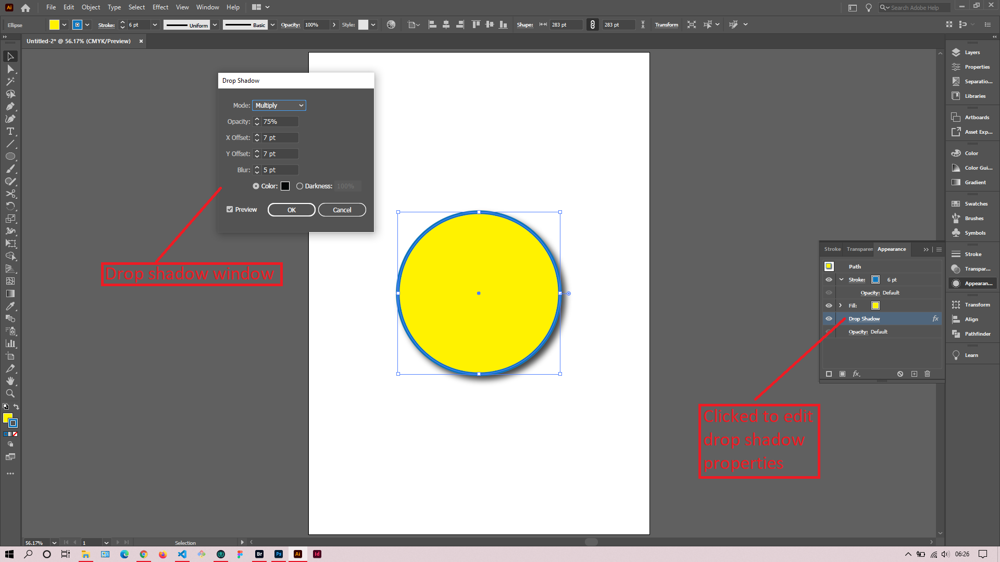

## About Lesson 13

### Brief
In this lesson, I learned about applying a drop shadow to an object and type. This is one of the basic effects availabe on Illustrator under the menu `Effect`

### Illustrations

In the illustration below, I applied a drop shadow to the shape object by navigating to the menu `Effect > Stylize > Drop Shadow`.

After clicking on the Drop Shadow menu I got a Drop Shadow window that I used to edit the properties of the effect.

Here, I used the Appearance palette to edit the drop shadow, stroke, fill and other effect properties applied to the object.

### Online Course
Visit [IACT](https://iact.ie) for the course