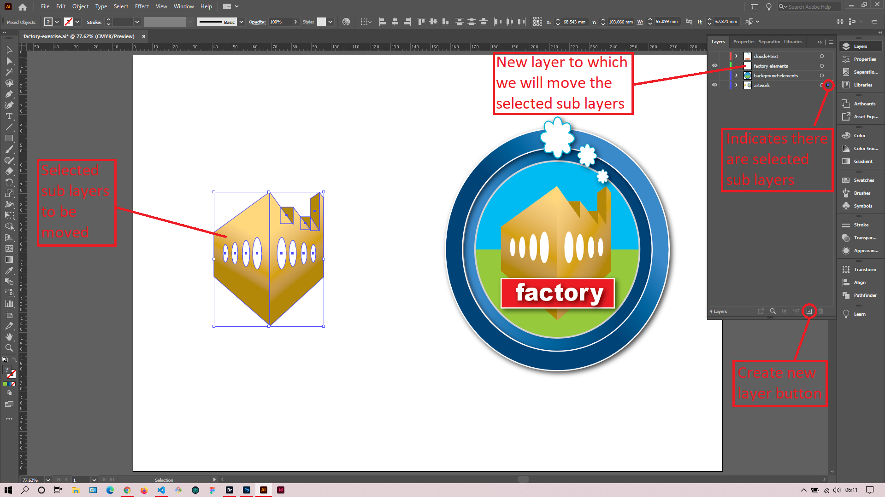
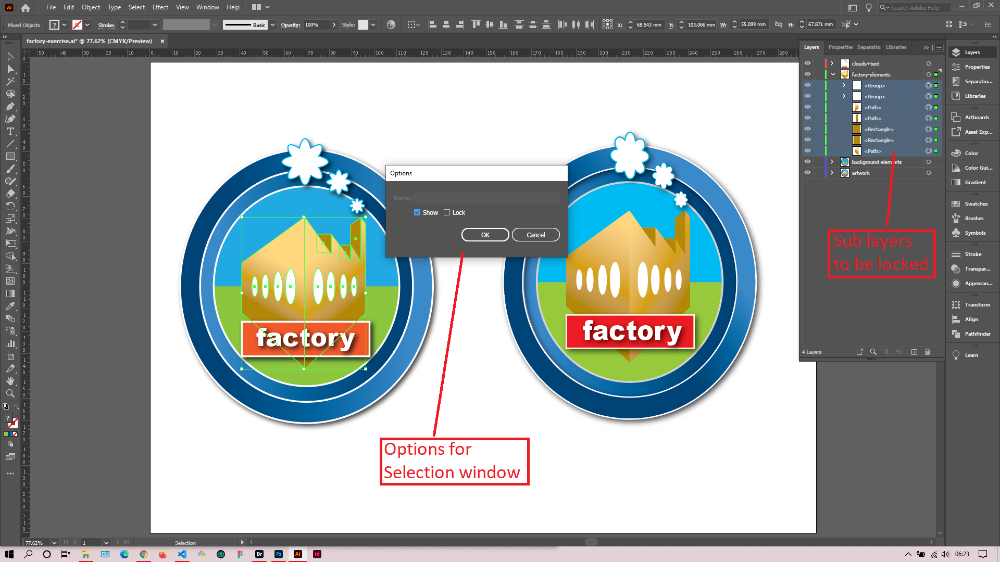

## About Lesson 14

### Brief
In this lesson, I learned how to create, name and arrange layers in Illustrator. Just like in Photoshop layers define the stacking order of elements and as elements get crowded it is good practice to name and group them.

### Illustrations

In the illustration below, I created a layer called factory-elements which would house the sub layers selected. To move these elements to the new layer, I first selected them and using the selection indicator(blue dot) on the layers palette I dragged and dropped them to the factory-elements layer. 

Here, I was able to lock layers that I selected by accessing the `Options for Selection` window via the dropdown in the layers palette.

### Online Course
Visit [IACT](https://iact.ie) for the course