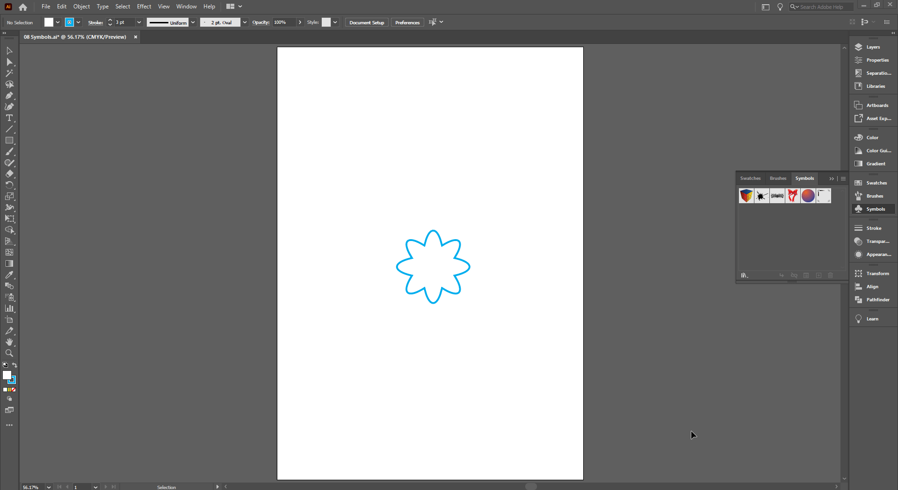
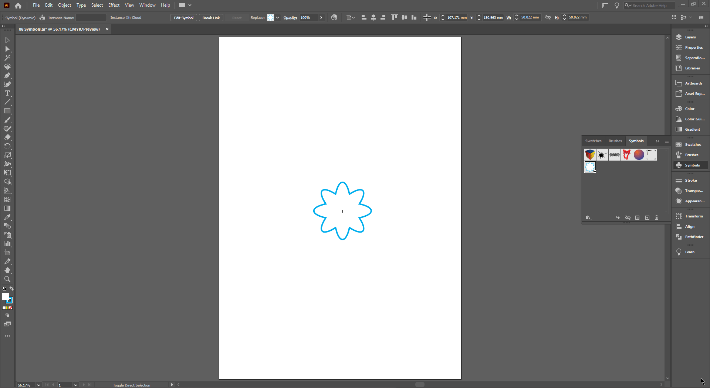
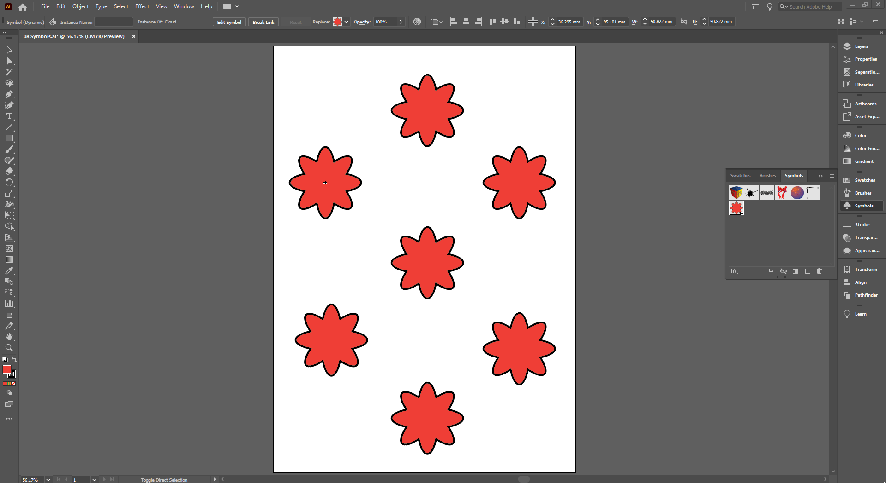

## About Lesson 15

### Brief
In this lesson, I learned about creating symbols from shape objects. I created a cloud shape which I used in this lesson to create, duplicate and edit symbol instances.

### Illustrations

In the illustration below, I created a symbol by dragging the selected cloud shape into the `Symbols` palette. This opened up a dialog box where I entered a custom name for it and changed the export type to 'Graphic'.

Here, I duplicated the symbol into multiple instances. To edit all instances at the same time, I double clicked on one instance to get into the edit mode. In this mode, I selected the symbol and changed the fill and stroke color. This inturn changed the fill and stroke color of all instances.

To edit a specific instance, I first selected it and clicked on the `Break Link to Symbol` button under the `Symbols` palette. This allowed me to change the fill and stroke color without affecting other symbol instances.

### Online Course
Visit [IACT](https://iact.ie) for the course