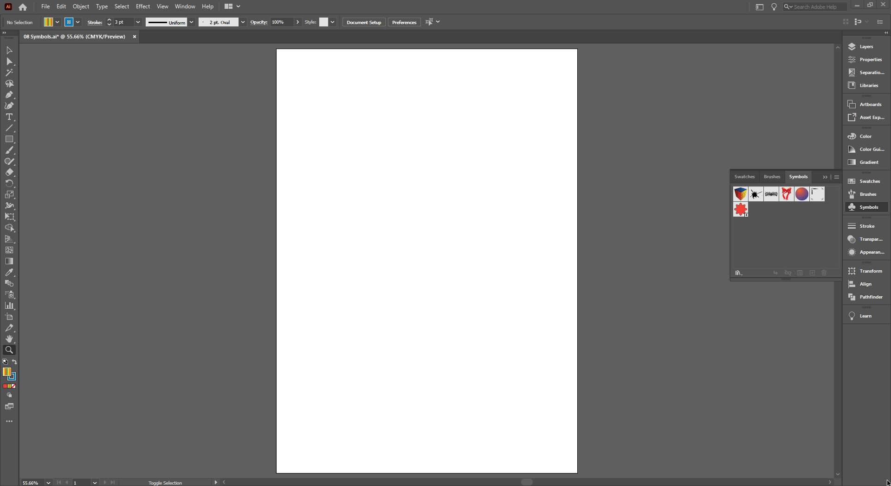
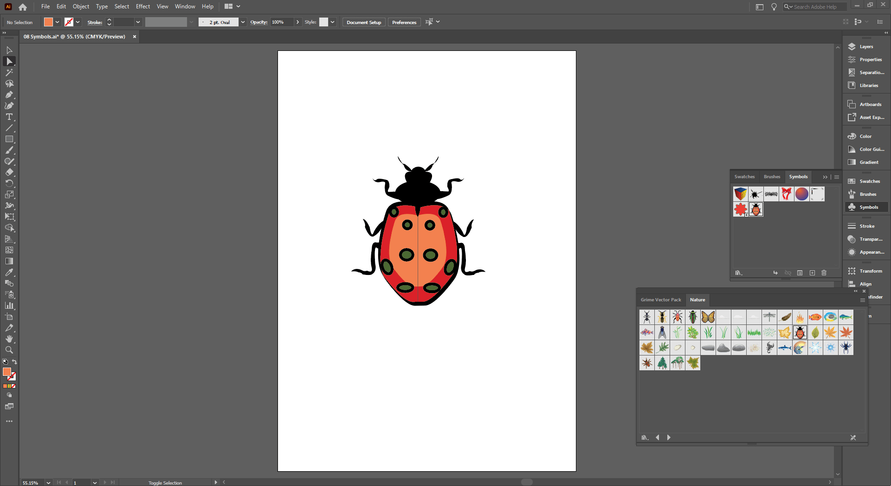

## About Lesson 16

### Brief
In this lesson, I learned about the symbol libraries accessed via the `Symbols` palette. These libraries have predefined symbols provided by illustrator.

### Illustrations

In the illustration below, I first opened the `Nature` symbol library by clicking on the button at the bottom left corner of the `Symbols` palette. I then created an instance of a symbol from this library.

Here, I was able to edit the symbol by double clicking the instance using the selection tool. This put me in an edit mode where I can use the direct selection tool to select and edit individual elements of the symbol instance.

Alternatively, to edit a symbol instance we can use the menu `Object > Expand` to give us the ability to modify it. 

### Online Course
Visit [IACT](https://iact.ie) for the course