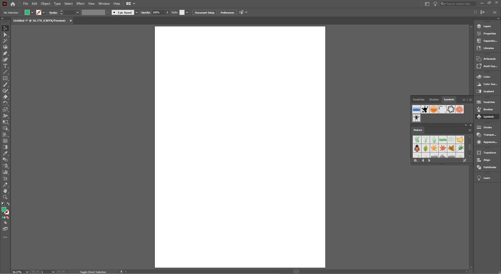
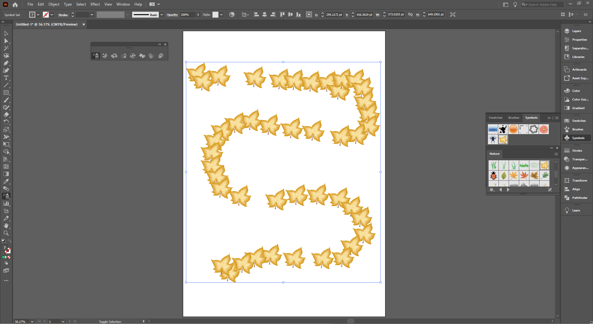
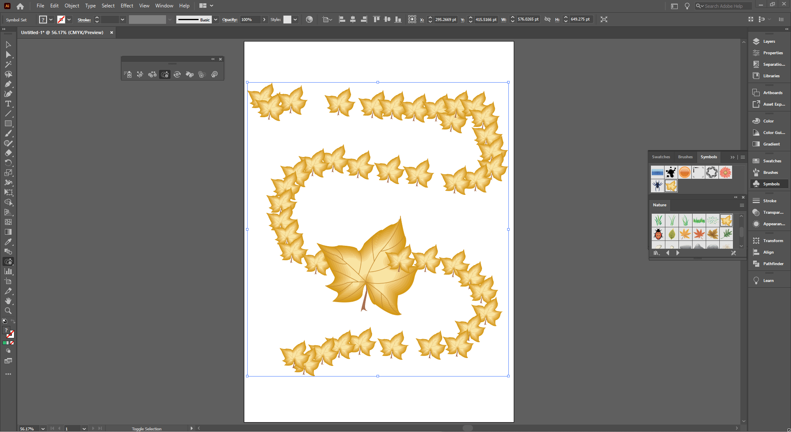
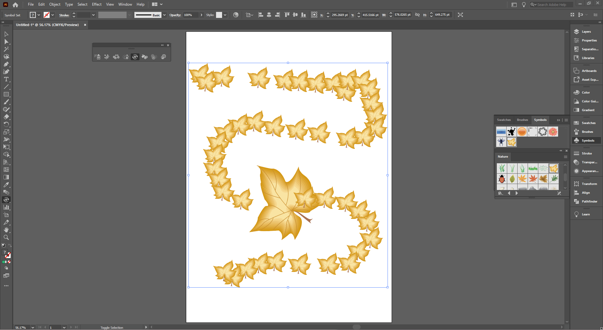
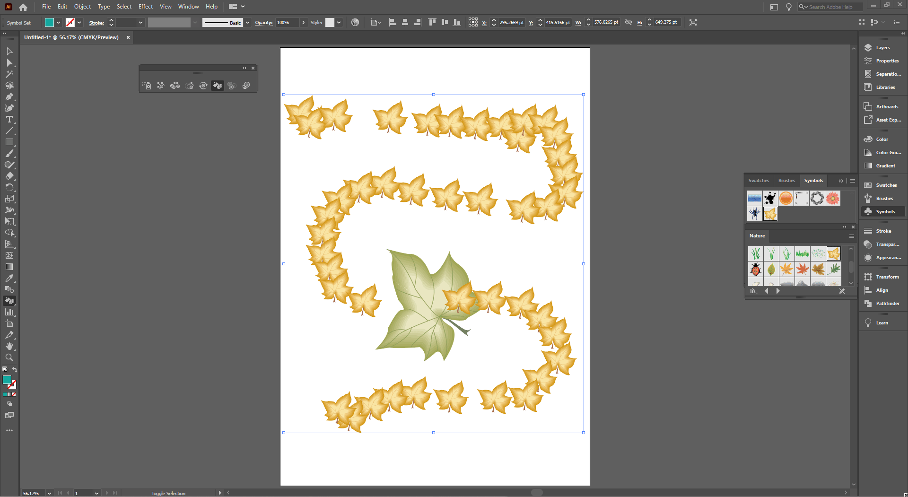

## About Lesson 17

### Brief
In this lesson, I learned about the various symbol tools in illustrator. These tools are used to modify symbols. The symbol tools include:
- Symbol Sprayer Tool
- Symbol Shifter Tool
- Symbol Scruncher Tool
- Symbol Sizer Tool
- Symbol Spinner Tool
- Symbol Stainer Tool
- Symbol Screener Tool
- Symbol Styler Tool

### Illustrations

Here, I used the symbol sprayer tool to spray onto the artboard a selected symbol from the nature library palette.

Here, I used the symbol sizer tool to increase the size of a symbol instance.

Here, I used the symbol spinner to rotate a symbol instance. 

Here, I used the symbol stainer tool to change the fill color of a symbol instance.

Here, I used thee symbol screener tool to change the transparency of a symbol instance.

### Online Course
Visit [IACT](https://iact.ie) for the course