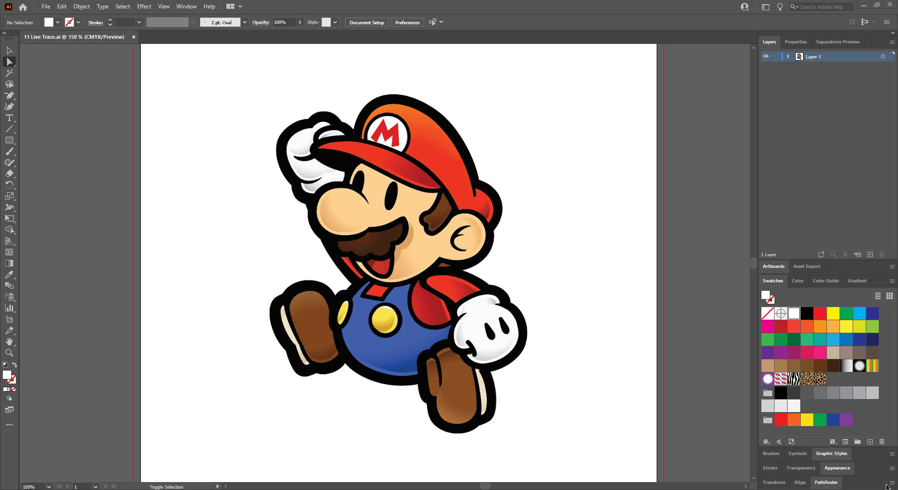
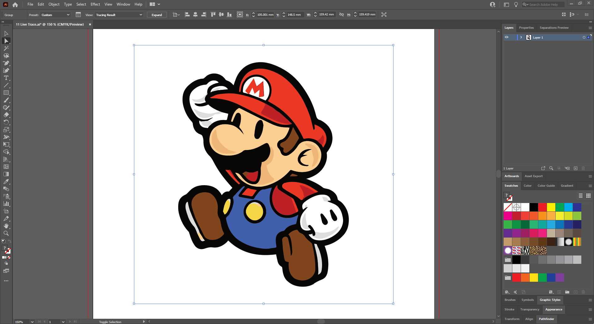
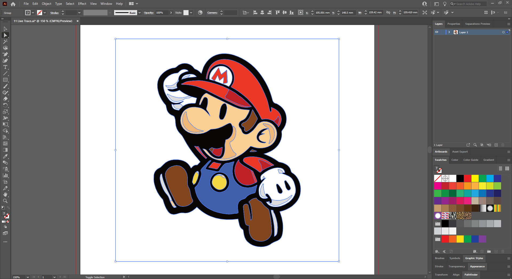

## About Lesson 18

### Brief
In this lesson, I learned how to live trace a bitmap into a vector. This can be done with any image and coverts it into vector shapes which can be modified using the various tools on illustrator.

### Illustrations

Here, I selected the image and clicked on the ```Image Trace``` option in the control bar where I selected ```Black and White Logo```. This inturn provided a toggle for the image trace palette. In this palette, I selected ```Color``` under 'Mode' and adjusted the 'Colors' slider to 10. In this stage the image had converted to a vector.



Here, I expanded the vector to be able to modify the different shapes.



Here, I first removed the white space in the background of the vector and added a green background using the rectangle tool. I also selected a shape and added a pattern to it. 



### Online Course
Visit [IACT](https://iact.ie) for the course