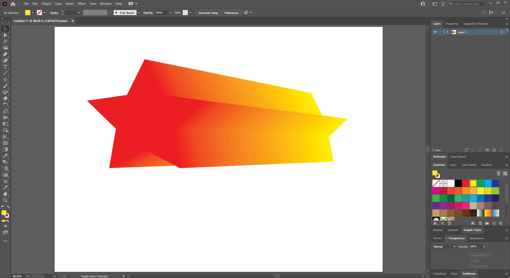
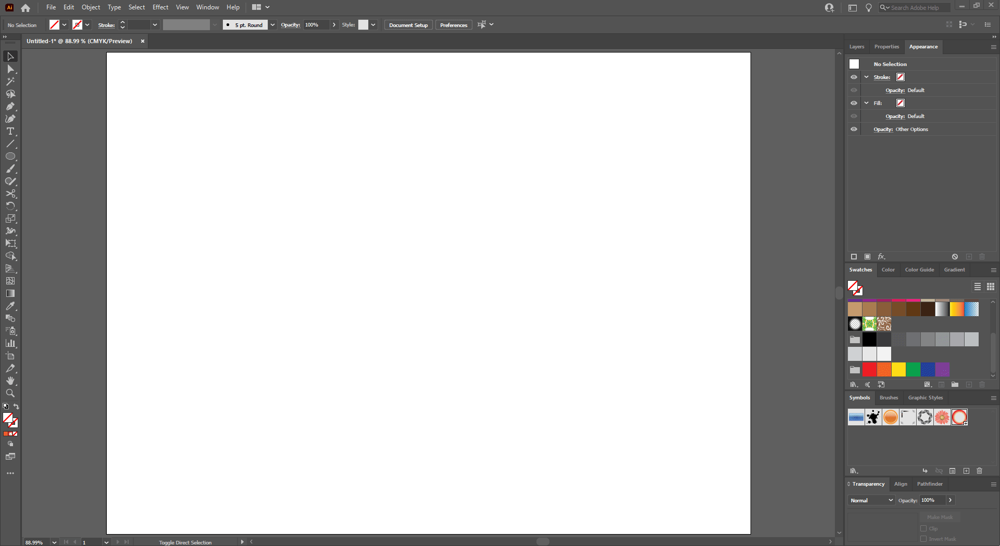
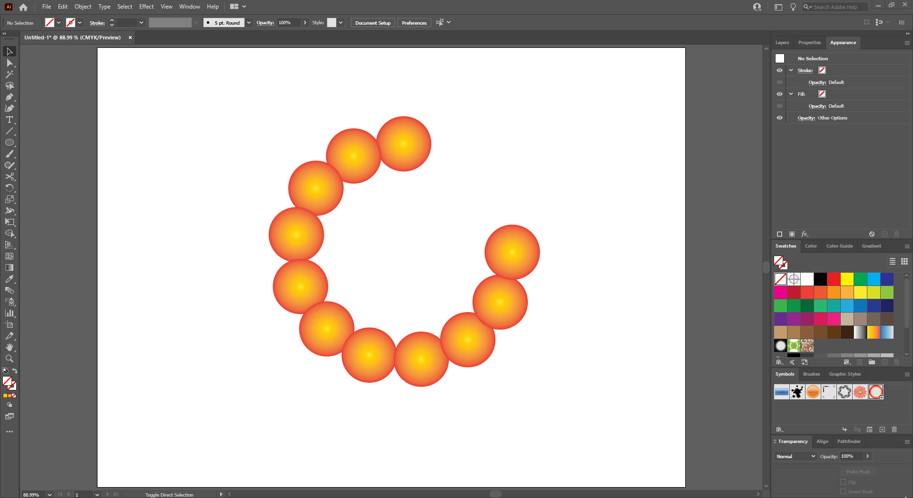

## About Lesson 19 - Blend Tool

### Brief
In this lesson, I learned about the ```Blend Tool``` and created blends between objects.

### Illustrations

Here, I created a star shape object and duplicated it. I then used the ```Blend Tool``` where I clicked on one object and clicked on the second object. This created a blend of colors between the two different colors of the objects. I also used the ```Direct Selection Tool``` to move around each object.


In this illustration, I selected the blend of objects and reduced the specified steps of the blend in the blend options window(```Object > Blend > Blend Options```). This action revealed a number of different colored objects that make the blend. Using the ```Direct Selection Tool``` I could select each individual object.



Here, I created an elipse shape object with a gradient and duplicated it. I applied a blend between the two objects and created another elipse shape to be used as the new spine(```Object > Blend > Replace Spine```) for the blended objects.



Here, I selected the new spine created and using the ```Scissor Tool``` cut the spine. This created an effect where the blended objects spread out evenly along the spine.



### Online Course
Visit [IACT](https://iact.ie) for the course