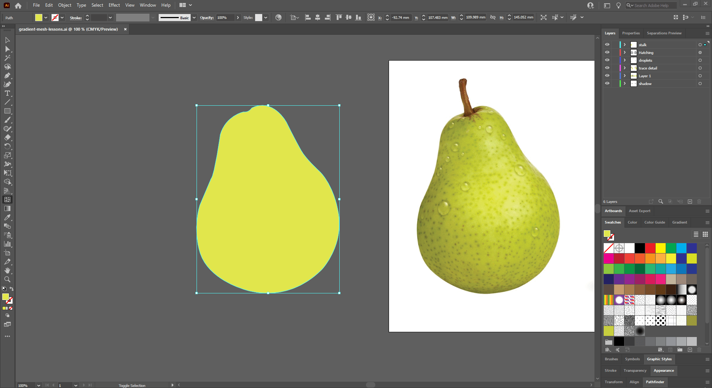
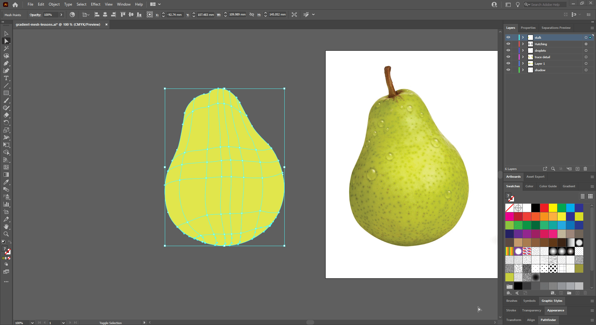
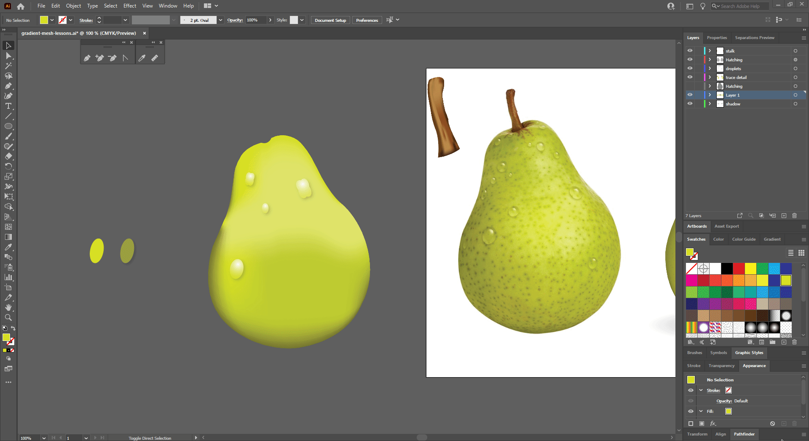
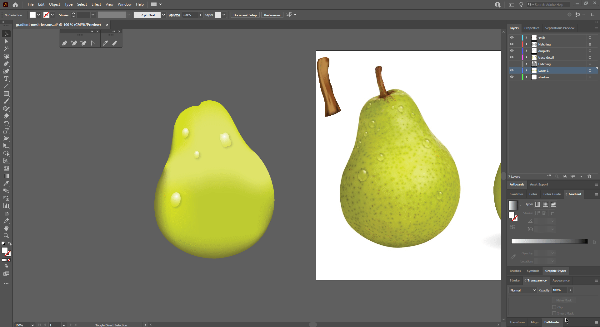

## About Lesson 19 - Gradient Mesh

### Brief
In this lesson, I learned about how to use the gradient mesh tool. I used it to create different selectable sections that I could modify and apply different using the ```Eyedropper tool```

### Illustrations

Here, I selected the gradient mesh tool and added anchor points to the pear trace I had created with the pen tool. The anchor points added in different parts of the pear formed a mesh dividing the pear into different sections.



Here, I selected anchor points of the desired sections using the direct selection tool. I then selected the eyedropper tool and sampled colors from the pear bitmap which got applied to the section selected in the pear trace.



Here, I first created two elipsis where I applied a drop shadow and reduced the opacity of one shape. I applied a gradient on the other shape and applied a ```blending``` mode using the ```transparency``` palette.



Here, I applied an effect called ```Pucker & Bloat```  to one of the grouped elipse shapes. This distorted the shape of the elipse object.



### Online Course
Visit [IACT](https://iact.ie) for the course