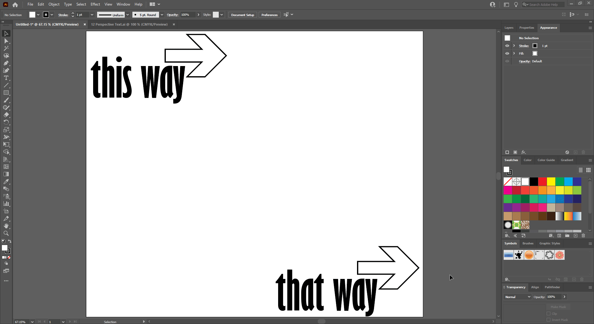
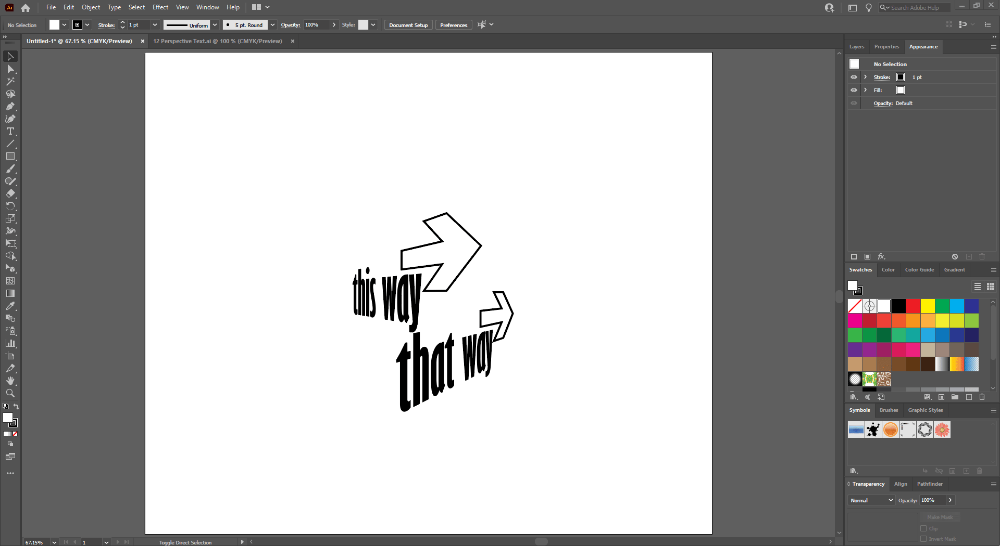

## About Lesson 20

### Brief
In this lesson, I learned about the various perspective grids and how to use them to create a 3D effect with artwork. For this I used the ```Perspective Grid Tool``` to create a default grid(Two Point Perspective) and the ```Perspective Selection Tool``` to select different parts of the grid and apply artwork on them.

### Illustrations

Here, I created a grid using the ```Perspective Grid Tool``` and navigated to ```View > Perspective Grid``` to tinker with the different grid types. In this illustration I applied the Two Point Perspective grid. With the ```Perspective Selection Tool``` I would first select a part of the grid and apply artwork to it.



If you try to move, scale or modify the artwork with the direct selection tool you will get a warning telling you to use the ```Perspective Selection Tool``` otherwise the artwork will be expanded.



### Online Course
Visit [IACT](https://iact.ie) for the course