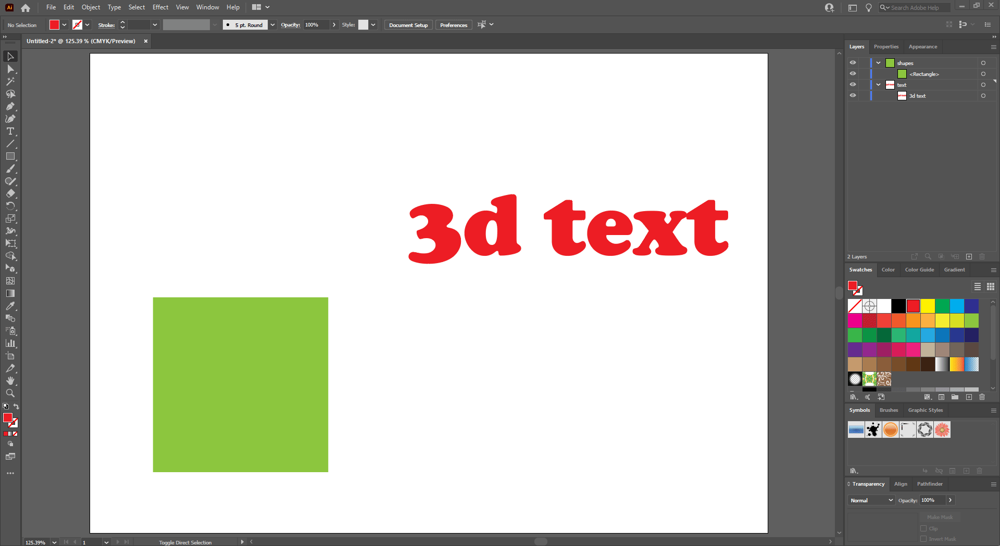
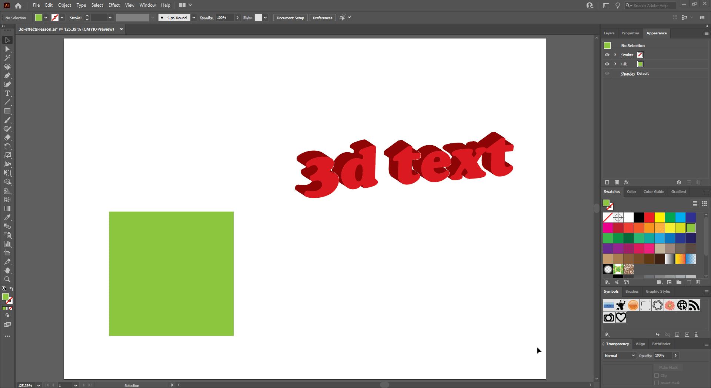

## About Lesson 21

### Brief
In this lesson, I learned about applying 3D effects under the menu ```Effect > 3D```

### Illustrations

In this example I applied an Extrude and Bevel 3D effect(```Effect > 3D > Extrude & Bevel```) to the text. Here, I modified the axis, extrude depth and lighting position on the surface.



Here, I applied and Extrude & Bevel 3D effect to the square shape object. Also added artwork to the sides of the 3D shape. To do this I used the ```Map Artwork``` option. Here I could access the document symbols library and could navigate to the desired surface and apply, scale and rotate a desired symbol onto the surface.



### Online Course
Visit [IACT](https://iact.ie) for the course