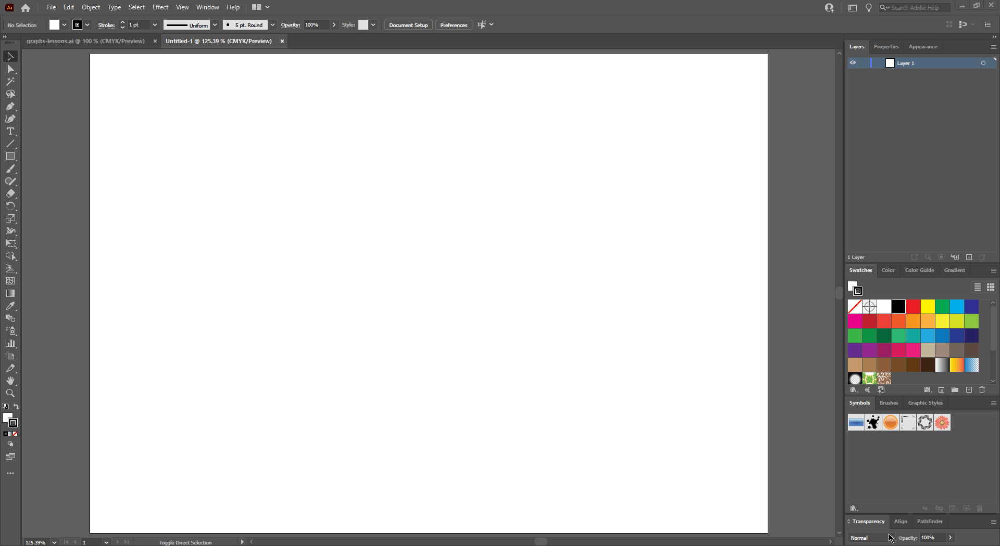

## About Lesson 22

### Brief
In this lesson, I learned about creating graphs and charts using the graph tools and applying 3D effects to them using the menu option ```Effect > 3D > Extrude & Bevel```

### Illustrations

In this example I created a graph using the ```Column Graph Tool``` where I first defined the legends of the graph and their values. I also added a background using the ```Rectangle Tool```. I then changed the colors of the legends as well as their fonts and the axis labels.



Here, I changed the type of the column graph to a pie chart by right clicking on the graph to get the ```type``` option. I then ungrouped the graph object until the ```Object > Ungroup``` option grayed out. I also applied a 3d effect to the chart(```Effect > 3D > Extrude & Bevel```) and legend colors.


### Online Course
Visit [IACT](https://iact.ie) for the course