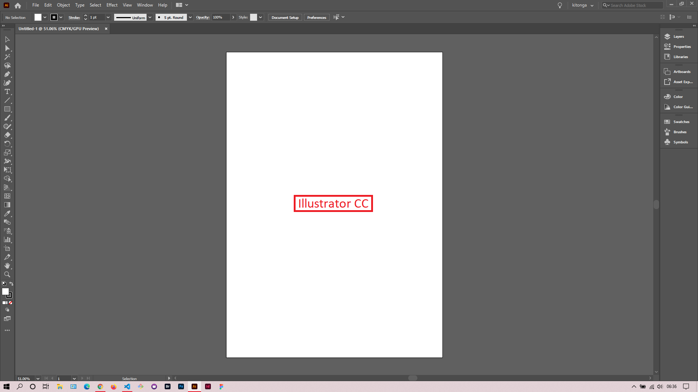

## About

This repository showcases my learning process and knowledge on Adobe Illustrator CC. This is my journey to UX/UI design greatness. 

### Note
This repository only has my notes for each lesson with screenshots. To view a lesson, just click on the lesson link and read its readme markdown file.

### Online Course
Visit [IACT](https://iact.ie) for the course